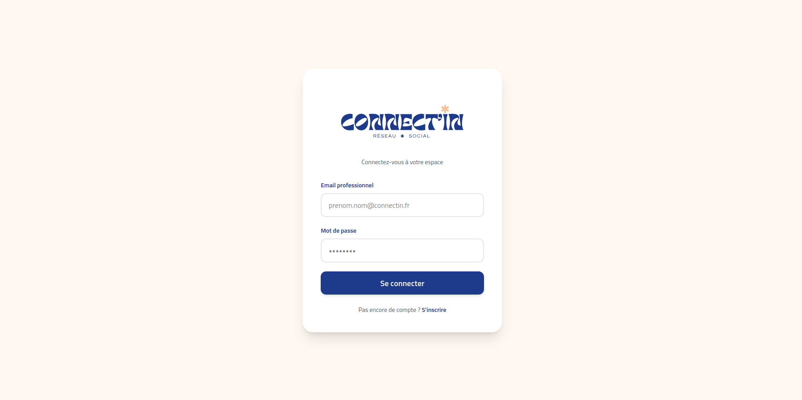
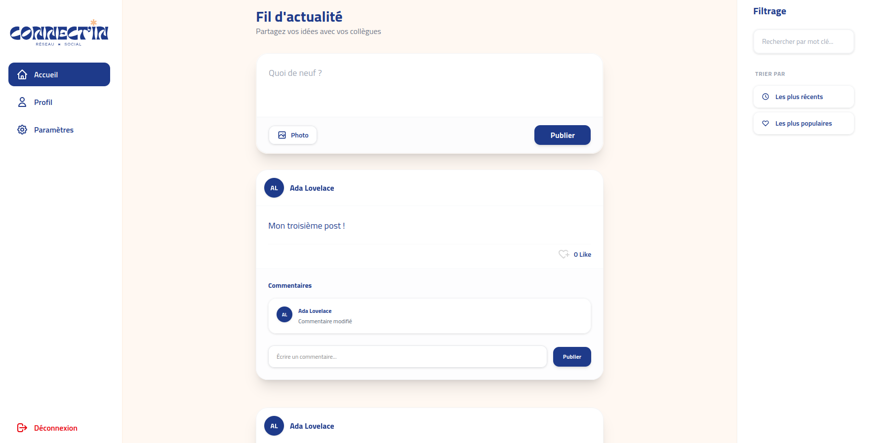
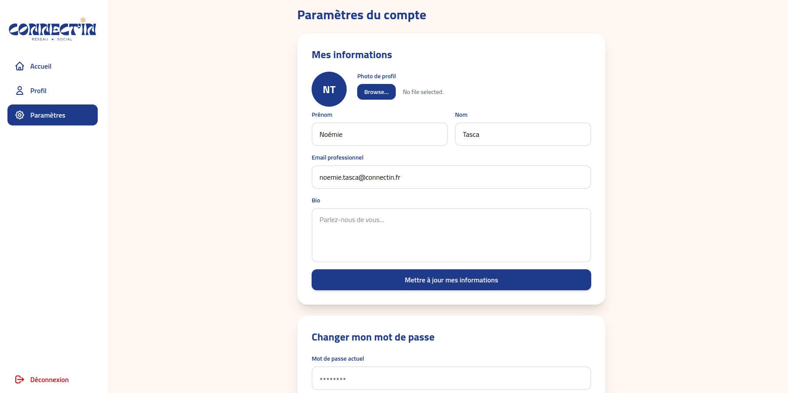

# Connect'In — Réseau social interne d'entreprise


**Connect'In** est une application web moderne de réseau social interne. Ce projet repose sur une architecture découplée offrant une expérience utilisateur fluide et une gestion sécurisée des données :

- **Back-end** : API REST développée avec **Laravel** et sécurisée par **Sanctum**.
- **Front-end** : Application **React** (build via Vite) stylisée avec **Tailwind CSS**.
- **Base de données** : **MySQL**.
- **Documentation API** : **Swagger (OpenAPI)**.

---

## Prévisualisation





---

## Pré-requis

* PHP 8.2+ & Composer
* Node.js & npm
* MySQL / MariaDB

---

## Installation & lancement

### 1) Backend (Laravel API)
```bash
cd connectin-api-back
composer install
cp .env.example .env
php artisan key:generate
```

Configurer la base MySQL dans `.env` :
```env
DB_DATABASE=
DB_USERNAME=
DB_PASSWORD=
SANCTUM_STATEFUL_DOMAINS=localhost:5173
FRONTEND_URL=http://localhost:5173
```

Puis lancer :
```bash
php artisan migrate
php artisan storage:link
php artisan serve
```

API disponible sur : `http://localhost:8000/api`

---

### 2) Frontend
```bash
cd connectin-api-front
npm install
npm run dev
```

Frontend disponible sur : `http://localhost:5173`

---

## Utilisation de l'API

Toutes les routes protégées nécessitent un token Bearer obtenu à la connexion.

**Inscription**
```http
POST /api/register
Content-Type: application/json

{ "first_name": "Jane", "last_name": "Doe", "email": "jane@company.com", "password": "secret123" }
```

**Connexion**
```http
POST /api/login
Content-Type: application/json

{ "email": "jane@company.com", "password": "secret123" }
```
Réponse : `{ "token": "..." }`

**Exemple de requête authentifiée**
```http
GET /api/posts
Authorization: Bearer {token}
```

---

## Documentation Swagger

Lancer le backend puis ouvrir :
`http://localhost:8000/api/documentation`

---

## Diagramme de la base de données

Disponible dans `Connect'In-Diagram.png`
